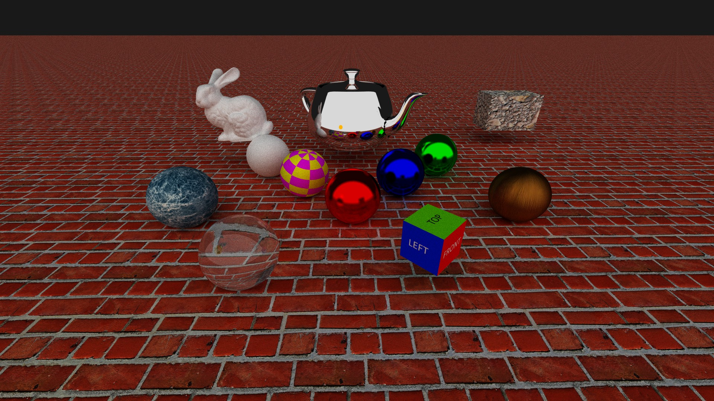

C++ Ray Tracer
==============

This is a very basic toy ray tracer, written in C++. There's nothing special
about this; it's the same as every other toy tracer written by every CS student
at some point.

Many years ago I wrote a ray tracer in Java back when I was a student in
University (see above), which was appallingly slow if instructive to figure out.
This is a new implementation in modern C++.

Originally written while I was sick at home, after being inspired by
[Dylan Beattie's talk](https://www.youtube.com/watch?v=PNKlC3lk9Kg) on making a
Javascript ray tracer, which also has a great accompanying
[online handbook](https://ursatile.github.io/jsray/) available.

Later improved with a better lighting model after reading the absolutely
wonderful [Raytracing in One Weekend](https://raytracing.github.io/) free book
series by Steve Hollasch.



## Building

This should be buildable under (at least) Windows and Linux.

### Windows (Visual Studio 2019+)

You should be able to open the `CMakelists.txt` file as a CMake project in
Visual Studio 2019 (or newer), then build from within the IDE.

Choosing the `install` option when right-clicking the top level
`CMakelists.txt` in the Solution Explorer will generate a redistributable
package on disk with all the required binaries and assets needed to run the
game.

The SFML library dependency is vendored in the repository, and statically
linked.

### Linux (GCC or Clang)

To build on Linux, install the `cmake`, `build-essential`, `ninja-build` and
`libsfml-dev` packages from your distribution's package manager as
prerequisites.

Once the prerequisites have been installed, build via:

```
cmake -B build/ -G "Ninja" .
cmake --build build
```

## License

Released under the [MIT license](LICENSE).
